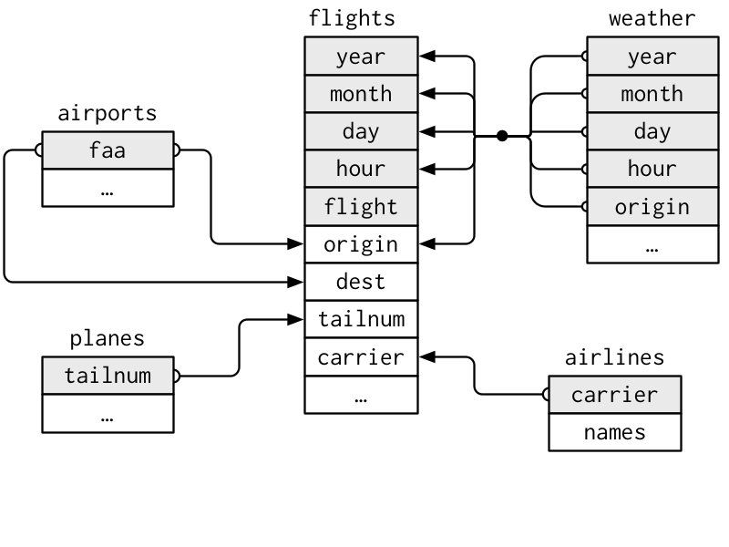

## Relational data

### Pendahuluan

#### Pada proses analisis data, kita jarang melibatkan hanya satu tabel data. Biasanya kita memiliki banyak tabel data untuk kita proses sesuai dengan tujuan kita, dan kita harus menggabungkannya dua atau tiga atau lebih untuk menjawab pertanyaan yang kita miliki. Secara kolektif, secara umum beberapa tabel data yang tergabung pada satu kesatuan disebut sebagai data relasional karena relasinya, bukan hanya kumpulan data individual, yang dianggap penting.

#### Relasi selalu ditentukan antara sepasang tabel / dua tabel. Semua relasi lainnya dibangun dari ide sederhana ini: relasi dari tiga tabel atau lebih selalu merupakan properti relasi antara setiap pasangan. Terkadang kedua elemen pasangan bisa menjadi tabel yang sama! Ini diperlukan jika, misalnya, jika kita memilki suatu data yang teridiri dari beberapa tabel, dan setiap  tabel memiliki referensi ke parent nya.

#### Perintah dalam dplyr (dibandingkan dengan perintah pada SQL) adalah sebagai berikut :

| Fungsi dalam dplyr| Fungsi dalam SQL |Keterangan                  |
|:------------------|:----------------:|---------------------------:|
|select()           | SELECT 	         |Menyeleksi kolom variabel   |
|filter()           | WHERE            |Menyaring (filter) baris    |
|group_by()         | GROUP_BY         |Mengelompokkan data         |
|summarise()        | tidak ada        |Merangkum data              |
|arrange()          | ORDER_BY         |Mengurutkan data            |
|mutate()           | COLUMN ALIAS     |Membuat kolom baru          |
|join()             | JOIN             |Menggabungkan data frame    |
|                   |                  |                            |

#### Untuk bekerja dengan data relasional, kita memerlukan kata kerja yang bekerja dengan pasangan tabel. Ada tiga kelompok kata kerja yang dirancang untuk bekerja dengan data relasional:

#### 1. Mutasi gabungan, yang menambahkan variabel baru ke satu bingkai data dari pengamatan yang cocok di yang lain.

#### 2. Gabungan pemfilteran, yang memfilter pengamatan dari satu bingkai data berdasarkan apakah mereka cocok atau tidak dengan pengamatan di tabel lain.

#### 3. Operasi set, yang memperlakukan observasi seolah-olah itu adalah elemen yang ditetapkan.

#### Tempat paling umum untuk menemukan data relasional adalah di sistem manajemen basis data relasional (atau RDBMS), istilah yang mencakup hampir semua basis data modern. Jika Anda pernah menggunakan database sebelumnya, Anda hampir pasti pernah menggunakan SQL. Jika demikian, Anda akan menemukan konsep dalam bab ini sudah tidak asing lagi, meskipun ekspresi mereka dalam dplyr sedikit berbeda. Secara umum, dplyr sedikit lebih mudah digunakan daripada SQL karena dplyr dikhususkan untuk melakukan analisis data: dplyr membuat operasi analisis data umum menjadi lebih mudah, maka kita bisa mempermudah untuk melakukan hal-hal lain yang biasanya diperlukan untuk analisis data pada seorang data sains.

### Prasyarat

#### Kami akan mengeksplorasi data relasional dari nycflights13 menggunakan library dplyr.

### Operator pipe: %>%

#### Pipe operator: %>% dalam dplyr diimport dari package magrittr. Pipe digunakan untuk menyalurkan output dari suatu fungsi ke input fungsi lain. Alih-alih menggunakan fungsi tersarang, digunakanlah pipe yang dibaca dari kiri ke kanan. Contoh:

### Lagkah 2

```{r}
library(dplyr)
library(tidyverse)
library(nycflights13)
library(ggplot2)
library(maps)
```
#### Maskapai penerbangan di ambil dari data set airlines, kita memungkinkan untuk mencari nama lengkap maskapai dan fungsi str() kita bisa mengetahui struktur dari data set airlines. 

### Lagkah 3

```{r}
str(airlines)
airlines
```
#### Bandara di ambil dari data set airports, kita memungkinkan untuk mencari nama lengkap bandara dan fungsi str() kita bisa mengetahui struktur dari data set bandara. 

### Lagkah 4

```{r}
str(airports)
airports
```
#### Pesawat terbang di ambil dari data set planes, kita memungkinkan untuk mencari nama lengkap planes dan fungsi str() kita bisa mengetahui struktur dari data set planes. 

### Lagkah 5

```{r}
str(planes)
planes
```

### Menggunakan select()

#### Lakukan seleksi terhadap kolom dengan sintak: select(data, …), isikan … dengan nama variabel yang ingin dipilih.

### Lagkah 6

```{r}
planes.se <- dplyr::select(planes, tailnum:manufacturer)
head(planes.se,n=5)
```

### Beberapa fungsi yang dapat digunakan dalam select():

#### 1. ends_with() : menyeleksi kolom dengan akhiran suatu karakter string
#### 2. contains() : menyeleksi kolom yang mengandung suatu karakter string
#### 3. matches() : menyeleksi kolom yang cocok dengan ekspresi
#### 4. one_of() : menyeleksi nama kolom dari sekelompok/grup nama


#### Kondisi cuaca di ambil dari data set weather, kita memungkinkan untuk mencari kondisi lengkap cuaca dan fungsi str() kita bisa mengetahui struktur dari data set weather. 

### Lagkah 7

```{r}
str(weather)
weather
```

### Menyeleksi baris dengan filter()

#### Lakukan seleksi weather yang temperaturnya lebir dari sama dengan 40 :

### Lagkah 8

```{r}
weather.se <- dplyr::filter(weather, temp >= 40)
print(weather.se)
```

#### Dapat pula digunakan operasi logika: < (kurang dari), > (lebih dari), <= (kurang dari sama dengan), >= (lebih dari sama dengan), == (sama dengan), != (tidak sama dengan), %in% (dalam).

### Operator pipe: %>%

#### Pipe operator: %>% dalam dplyr diimport dari package magrittr. Pipe digunakan untuk menyalurkan output dari suatu fungsi ke input fungsi lain. Alih-alih menggunakan fungsi tersarang, digunakanlah pipe yang dibaca dari kiri ke kanan. Contoh:

### Lagkah 9

```{r}
head(select(weather, origin, year, temp), n = 5)
```

#### dengan menggunakan pipe, dapat dituliskan sebagai berikut :

```{r}
weather %>%
  select(origin, year, temp) %>%
  head(n = 5)
```

### Menyusun menggunakan arrage()

#### Untuk mengurutkan suatu kolom, gunakan arrange(). Urutkan data weather, berdasarkan variabel temperature :

### Lagkah 10

```{r}
weather.ar <- arrange(weather, temp)
head(weather.ar , n = 10)
```

### Gunakan desc() untuk mengurutkan dari yang terbesar ke yang terkecil:

### Lagkah 11

```{r}
weather.ab <- arrange(weather, desc(temp))
head(weather.ab , n = 10)
```

### Membuat kolom dengan mutate()

#### Buat kolom weather_proportion yang merupakan rasio temp terhadap dewp :

### Lagkah 12

```{r}
weather %>%
  mutate(weather_proportion = temp/dewp) %>%
  head(5)
```

### Membuat rangkuman data frame menggunakan summarise()

#### Untuk melakukan perhitungan statistika dalam suatu kolom, gunakan summarise(). Beberapa fungsi statistika sederhana yang dapat digunakan adalah mean(), median(), sd(), min(), max(), n() untuk mengetahui panjang dari vektor, n_distinct() untuk mengetahui jumlah nilai yang berbeda dalam suatu vektor, first() mengetahui nilai pertama suatu vektor, dan last() mengetahui nilai terakhir suatu vektor.

### Tampilkan nilai rata-rata, median, minimum, dan maximum dari variabel temp :

### Lagkah 13

```{r}
weather %>%
  summarise(rata2 = mean(dewp), median = median(dewp), 
            minimum = min(dewp), maximum = max(dewp))
```

### Mengelompokkan operasi dengan group_by()

#### Fungsi group_by() berhubungan dengan konsep “split-apply-combine”. Misalkan, kita menginginkan untuk memisah (split) data frame menggunakan suatu variabel (contoh order taksonomi), mengaplikasikan (apply) fungsi secara individual dalam data frame, dan mengkombinasi (combine) outputnya.

### Pisahkan (split) data frame berdasarkan variabel order, kemudian tampilan ringkasan statistika seperti sebelumnya:

### Lagkah 14

```{r}
weather %>%
  group_by(month) %>%
 summarise(rata2 = mean(dewp), median = median(dewp), 
            minimum = min(dewp), maximum = max(dewp))
```

#### Salah satu cara untuk menunjukkan hubungan antara tabel yang berbeda adalah dapat ditunjukkan dengan diagram sebagai berikut :



#### Diagram pada gambar realitional tabel seperti diatas, tetapi sederhana dibandingkan dengan diagram yang akan kita lihat di pada kenyataan yang kita hadapi, untuk memahami diagram seperti diatas dengan mengingat setiap relasi selalu menyangkut sepasang tabel. Kita tidak perlu memahami semuanya; kita hanya perlu memahami rantai hubungan antar tabel yang kita miliki. 

#### Untuk tabel nycflights13 :

#### 1. flights terhubung dengan planes melalui satu variable, tailnum.
#### 2. flights terhubung dengan airlines melalui variable pembawa.
#### 3. flights terhubung dengan airports pada dua cara : yaitu melalui the origin and dest variables.
#### 4. flights terhubung dengan weather melalui origin (the location), dan year, month, day dan hour (the time).

### Kunci

#### Variabel yang digunakan untuk menghubungkan setiap pasangan tabel dikatakan sebagai kunci. Kunci adalah variabel (atau kumpulan variabel) yang secara unik mengidentifikasi observasi. Dalam kasus sederhana, satu variabel sudah cukup untuk mengidentifikasi observasi. Misalnya, setiap bidang diidentifikasi secara unik oleh tailnumnya. Dalam kasus lain, beberapa variabel mungkin diperlukan. Misalnya, untuk mengidentifikasi pengamatan cuaca, kita memerlukan lima variabel: tahun, bulan, hari, jam, dan asal.
 
### Ada dua jenis kunci:

#### 1. A primary key / Kunci utama adalah variabel yang unik untuk mengidentifikasi observasi di tabelnya sendiri. Misalnya, planes$tailnum adalah kunci utama karena kunci ini secara unik mengidentifikasi setiap bidang di tabel plane.

#### 2. A foreign key / Kunci asing adalah variabel yang unik untuk mengidentifikasi observasi di tabel lain. Misalnya, flight$tailnum adalah kunci asing karena muncul di tabel flight yang mencocokkan setiap flight dengan plane.
 
#### Sebuah variabel dapat berupa kunci utama dan kunci asing. Misalnya, origin adalah bagian dari kunci utama weather, dan juga kunci asing untuk tabel airport.

#### Setelah kita mengidentifikasi kunci utama di tabel, praktik yang baik adalah memverifikasi bahwa kunci tersebut memang mengidentifikasi setiap pengamatan secara unik. Salah satu cara untuk melakukannya adalah dengan fungsi count() pada kunci utama dan mencari entri di mana n lebih besar dari satu:

### Lagkah 15

```{r}
planes %>% 
  count(tailnum) %>% 
  filter(n > 1)

weather %>% 
  count(year, month, day, hour, origin) %>% 
  filter(n > 1)
```

#### Terkadang tabel tidak memiliki kunci utama secara eksplisit: dimana setiap baris dapat dikatakan sebagai pengamatan, tetapi tidak ada kombinasi variabel yang dapat diandalkan untuk mengidentifikasi sebagai kunci utama. Misalnya, apa kunci utama di tabel flights ? Kita mungkin dapat mengira bahwa kata kunci adalah date dan  tailnum , tetapi tidak ada yang unik:

### Lagkah 16

```{r}
flights
```

### Lagkah 17

```{r}
flights %>% 
  count(year, month, day, flight) %>% 
  filter(n > 1)

flights %>% 
  count(year, month, day, tailnum) %>% 
  filter(n > 1)
```

#### Saat mulai bekerja dengan data set ini, kita bisa berasumsi bahwa setiap flight number hanya akan digunakan sekali per hari: itu akan membuatnya lebih mudah untuk mengkomunikasikan masalah dengan flight tertentu. Sayangnya, itu bukan masalahnya! Jika tabel tidak memiliki kunci utama, terkadang berguna untuk menambahkannya dengan fungsi mutate() dan fungsi row_number(). Itu membuatnya lebih mudah untuk mencocokkan pengamatan jika kita telah melakukan beberapa pemfilteran dan ingin memeriksa kembali dengan data asli. Ini dapat disebut sebagai kunci pengganti.

#### Kunci utama dan kunci asing terkait di tabel lain akan membentuk relasi. Hubungan biasanya satu-ke-banyak. Misalnya setiap penerbangan memiliki satu pesawat, tetapi setiap pesawat memiliki banyak penerbangan. Di data lain, kita terkadang akan melihat hubungan 1-dengan-1. Kita dapat menganggap ini sebagai kasus khusus yaitu 1-ke-banyak. Kita dapat memodelkan relasi banyak-ke-banyak dengan relasi banyak-ke-1 ditambah relasi 1-ke-banyak. Misalnya, dalam data ini ada hubungan banyak ke banyak antara airlines dan airports: setiap airline ke banyak airports; setiap airport menampung banyak airlines.

### Mutating joins

#### Alat pertama yang akan kita lihat untuk menggabungkan sepasang tabel adalah mutating join. Mutating join memungkinkan kita menggabungkan variabel dari dua tabel. Ini pertama kali mencocokkan observasi dengan kuncinya, kemudian menyalin seluruh variabel dari satu tabel ke tabel lainnya.

#### Seperti fungsi mutate(), fungsi gabungan menambahkan variabel ke kanan, jadi jika kita sudah memiliki banyak variabel, variabel baru tidak akan dicetak. Untuk contohnya seperti ini, kami akan mempermudah untuk melihat apa yang terjadi di contoh dengan membuat kumpulan data yang lebih sempit:

### Lagkah 18

```{r}
flights2 <- flights %>% 
  select(year:day, hour, origin, dest, tailnum, carrier)
flights2
```

#### (Ingat, saat kita berada di RStudio, kita juga dapat menggunakan fyngsi View() untuk menghindari masalah ini.)

#### Bayangkan kita ingin menambahkan nama lengkap maskapai penerbangan ke data flights2. Kita dapat menggabungkan bingkai data maskapai dan penerbangan2 dengan left_join ():

### Lagkah 20

```{r}
flights2 %>%
  select(-origin, -dest) %>% 
  left_join(airlines, by = "carrier")
```

#### Hasil dari bergabungnya airlines ke flights2 adalah variabel tambahan: name. Inilah mengapa kita menyebut jenis join ini sebagai mutating join. Dalam kasus ini, kita bisa mendapatkan tempat yang sama menggunakan mutate() dan subset dasar R.

### Lagkah 21

```{r}
flights2 %>%
  select(-origin, -dest) %>% 
  mutate(name = airlines$name[match(carrier, airlines$carrier)])
```

#### Tetapi ini sulit untuk digeneralisasi ketika kita perlu mencocokkan beberapa variabel, dan membutuhkan pembacaan yang cermat untuk mengetahui maksud keseluruhan.

#### Bagian berikut menjelaskan, secara rinci, cara kerja mutating joins. Kita akan mulai dengan mempelajari representasi visual yang berguna dari gabungan. Kita kemudian akan menggunakannya untuk menjelaskan empat mutating join functions :  inner join, dan tiga outer joins. Saat bekerja dengan data nyata, kunci tidak selalu mengidentifikasi pengamatan secara unik, jadi selanjutnya kita akan membicarakan tentang apa yang terjadi jika tidak ada kecocokan unik. Terakhir, Anda akan mempelajari cara memberi tahu fungsi dplyr tentang variabel mana yang merupakan kunci untuk gabungan tertentu.

### Mendefinisikan kolom kunci

#### Selama ini, pasangan tabel selalu digabungkan dengan satu variabel, dan variabel tersebut memiliki nama yang sama di kedua tabel. Batasan itu dikodekan oleh = "key". Kita dapat menggunakan nilai lain untuk oleh untuk menyambungkan tabel dengan cara lain:

#### 1. Defaultnya, by = NULL, menggunakan semua variabel yang muncul di kedua tabel, yang disebut natural join. Misalnya, tabel flights dan weather cocok dengan variabel umumnya: year, month, day, hour dan origin.

### Lagkah 22

```{r}
flights2 %>% 
  left_join(weather)
```

#### 2. Vektor karakter, dengan = "x". Ini seperti gabungan alami, tetapi hanya menggunakan beberapa variabel umum. Misalnya, flights dan planes memiliki variabel year, tetapi artinya berbeda, jadi kami hanya ingin menggabungkan berdasarkan tailnum.

### Lagkah 23

```{r}
flights2 %>% 
  left_join(planes, by = "tailnum")
```

#### Perhatikan bahwa variabel year  (yang muncul di kedua bingkai data masukan, tetapi tidak dibatasi agar sama) tidak ambigu dalam keluaran dengan sufiks.

#### 3. Vektor karakter bernama: oleh = c ("a" = "b"). Ini akan mencocokkan variabel a di tabel x dengan variabel b di tabel y. Variabel dari x akan digunakan dalam output.
#### Misalnya jika kita ingin menggambar peta kita perlu menggabungkan data  flights dengan data airports yang berisi lokasi (lat dan lon) dari setiap bandara. Setiap flight  memiliki airport asal dan tujuan, jadi kita perlu menentukan mana yang ingin kami ikuti:

### Lagkah 24

```{r}
flights2 %>% 
  left_join(airports, c("dest" = "faa"))
```

```{r}
flights2 %>% 
  left_join(airports, c("origin" = "faa"))
```

### Filtering joins

#### Memfilter gabungan pengamatan cocok dengan cara yang sama seperti mutating joins, tapi mempengaruhi pengamatan, bukan variabel. Ada dua jenis:

#### 1. semi_join (x, y) menyimpan semua observasi di x yang memiliki kecocokan di y.
#### 2. anti_join (x, y) menghapus semua observasi di x yang memiliki kecocokan di y.

#### Semi_join berguna untuk mencocokkan tabel ringkasan yang difilter kembali ke baris asli. Misalnya, bayangkan kita telah menemukan sepuluh tujuan terpopuler:

### Lagkah 25

```{r}
top_dest <- flights %>%
  count(dest, sort = TRUE) %>%
  head(10)
top_dest
```

#### Sekarang kita ingin menemukan setiap penerbangan yang menuju ke salah satu tujuan tersebut. Kita dapat membuat filter sendiri:

### Lagkah 26

```{r}
flights %>% 
  filter(dest %in% top_dest$dest)
```

#### Tetapi sulit untuk memperluas pendekatan itu ke banyak variabel. Misalnya, bayangkan kita menemukan 10 hari dengan rata-rata penundaan tertinggi. Bagaimana Anda membuat pernyataan filter yang menggunakan tahun, bulan, dan hari untuk mencocokkannya kembali ke penerbangan?

#### Sebagai gantinya kita dapat menggunakan semi-join, yang menghubungkan dua tabel seperti mutating join, tetapi alih-alih menambahkan kolom baru, hanya pertahankan baris dalam x yang memiliki kecocokan di y:

### Lagkah 27

```{r}
flights %>% 
  semi_join(top_dest)
```
#### Anti-gabungan berguna untuk mendiagnosis ketidakcocokan gabungan. Misalnya, saat menghubungkan penerbangan dan pesawat, Anda mungkin tertarik untuk mengetahui bahwa ada banyak penerbangan yang tidak memiliki kecocokan dalam pesawat:

### Lagkah 28

```{r}
flights %>%
  anti_join(planes, by = "tailnum") %>%
  count(tailnum, sort = TRUE)
```

### Tugas untuk mendapatkan sertifikat kelulusan, hasil di upload di Facebook

#### Buatkan informasi tentang kondisi bandara dan di upload dan publish secara online di RShiny, salah satunya tentang penundaan rata-rata berdasarkan tujuan, lalu gabungkan pada bingkai data bandara sehingga kita dapat menunjukkan distribusi spasial dalah satunya tentang penundaan. Berikut contoh cara mudah menggambar peta Amerika Serikat dan bandara nya:

```{r}
airports %>%
  semi_join(flights, c("faa" = "dest")) %>%
  ggplot(aes(lon, lat)) +
    borders("state") +
    geom_point() +
    coord_quickmap()
```

### Daftar Pustaka

#### 1. https://rmarkdown.rstudio.com/lesson-1.html

#### 2. https://ourcodingclub.github.io/tutorials/rmarkdown/


