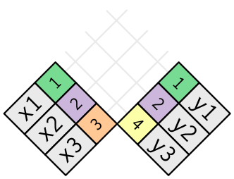

### Langkah 1

```{r}
library(tidyverse)
```

#### Perintah dalam dplyr (dibandingkan dengan perintah pada SQL) adalah sebagai berikut :

| Fungsi dalam dplyr| Fungsi dalam SQL |Keterangan                  |
|:------------------|:----------------:|---------------------------:|
|select()           | SELECT 	         |Menyeleksi kolom variabel   |
|filter()           | WHERE            |Menyaring (filter) baris    |
|group_by()         | GROUP_BY         |Mengelompokkan data         |
|summarise()        | tidak ada        |Merangkum data              |
|arrange()          | ORDER_BY         |Mengurutkan data            |
|mutate()           | COLUMN ALIAS     |Membuat kolom baru          |
|join()             | JOIN             |Menggabungkan data frame    |
|                   |                  |                            |

### Memahami joins

#### Untuk membantu kita mempelajari cara kerja joins, kita akan menggunakan representasi visual:


#### Kolom berwarna adalah mewakili variabel "key", variabel ini digunakan untuk mencocokkan baris pada tabel data set tersebut. Sedangkan untuk kolom abu-abu menunjukkan kolom "value", variabel ini digunakan menjelaskan deskripsi tentang nilai pada variabel key pada tabel data set tersebut.

#### Untuk menciptakan tabel data set x dan tabel dataset y dengan menggunakan fungsi trible(), fungsi ini digunakan untuk mnegatur tata letak baris demi baris yang lebih mudah dibaca. Ini berguna untuk tabel data kecil di mana keterbacaan nya penting. 

### Langkah 2

```{r}
x <- tribble(
  ~key, ~val_x,
     1, "x1",
     2, "x2",
     3, "x3"
)
y <- tribble(
  ~key, ~val_y,
     1, "y1",
     2, "y2",
     4, "y3"
)
```

### Langkah 3

```{r}
x
y
```

#### Untuk menghubungkan kedua tabel data set tersebut maka sebagai acuan untuk mencocokkan adalah pada variabel "key". Dalam contoh ini, kita akan mencocokan antara variabel "key" pada tabel x, dengan variabel "key" pada tabel y, kedua tabel tersebut digeneralisasi secara langsung ke beberapa key dan ke beberapa value.

#### Untuk mendapatkan gabungan kedua tabel adalah dengan cara menghubungkan setiap baris di tabel x yang ke nol, satu, kedua atau lebih, dengan setiap baris di tabel y. Pada diagram berikut menunjukkan setiap potensi kecocokan sebagai perpotongan dari sepasang garis.



#### (Jika kita melihat lebih dekat, kita mungkin memperhatikan bahwa kita dapat mengganti urutan kolom pada variabel "key" dan variabel "value" di  tabel x. Disi kita bisa menekankan bahwa penggabungan adalah mencocokan kedua tabel berdasarkan variabel "key" ; kemudian nilainya akan dibawa ke salah satu tabel.)

#### Dalam gabungan yang sebenarnya, kecocokan akan ditunjukkan dengan titik. Jumlah titik = jumlah pencocokan = jumlah baris yang akan dibawah ke salah satu tabel.

#### 1. Inner join

#### Jenis gabungan yang paling sederhana adalah Inner join. Inner join adalah proses penggabungan dua tabel, dimana dalam mencocokkan nya menggunakan dengan variabel "key" yang sama pada kedua tabel. 

#### (Tepatnya, ini adalah inner equijoin karena kuncinya adalah mencocokkan kedua tabel menggunakan operator persamaan. Karena kebanyakan gabungan yang ada adalah equijoin.)

#### Output dari inner join adalah bingkai data baru yang berisi key, value tabel x, dan value tabel y. Kita dapat menggunakan fungsi tersebut dengan menggunakan library dplyr.


#### Pada gambar dapat dilihat bahwa penggabungan dapat dilakukan dengan titik-titik karena terdapat variabel "key" yang sama pada kedua tabel. Sehingga dapat dibuat tabel gabungan dengan nilai variabel "key" yang sama, dengan mengikuti variabel "value" pada tabel x dan tabel y.

### Langkah 4

```{r}
x %>% 
  inner_join(y, by = "key")
```

#### Properti terpenting dari inner join adalah bahwa baris yang tidak cocok tidak disertakan dalam hasil pada tabel gabungan. Artinya, secara umum inner join biasanya tidak sesuai untuk digunakan dalam analisis karena terlalu mudah untuk kehilangan data.

### Outer joins

#### Inner join akan menyimpan data sesuai dengan variabel "key" sama dan variabel "value" yang muncul di kedua tabel. Outer joins akan menyimpan data yang berbeda dengan inner joint, dimana data yang sesuai dan muncul di salah satu tabel. Ada tiga jenis Outer joins:

#### 1. A left joint adalah menyimpan semua pengamatan di x.
#### 2, A right joint adalah menyimpan semua pengamatan di y.
#### 3. A full joint adalah menjaga semua pengamatan di x dan y.

#### Proses joint ini bekerja dengan menambahkan variabel "value" menjadi data "virtual" pada salah satu tabel. Hasil nya dapat memiliki key yang selalu cocok (jika tidak ada kunci lain yang cocok), dan value diisi dengan NA. Secara grafis, itu terlihat seperti:


#### Left Joint


### Langkah 5

```{r}
x <- tribble(
  ~key, ~val_x,
     1, "x1",
     2, "x2",
     3, "x3"
)
y <- tribble(
  ~key, ~val_y,
     1, "y1",
     2, "y2",
     4, "y3"
)
```

### Langkah 6

```{r}
left_join(x,y)
```

### Right Joint


### Langkah 7

```{r}
right_join(x,y)
```

### Full Joint


### Langkah 8

```{r}
full_join(x,y)
```

#### Operasi joint yang paling umum digunakan adalah left joint : Kita menggunakan proses left joint setiap kali kita mencari data tambahan dari tabel lain, karena observasi asli tetap dipertahankan meskipun tidak ada kecocokan. left joint harus menjadi proses joint secara default : proses ini left joint kita pertahankan untuk digunakan, kecuali kita memiliki alasan kuat untuk memilih salah satu proses outer joint yang lain. Cara lain untuk menggambarkan berbagai jenis operasi outher joint adalah dengan diagram Venn:


#### Model diagram Venn, adalah tidak merepresentasikan yang bagus. Kadang kala  mengganggu gambaran kita tentang operasi joint karena sulit untuk mengetahui tentang tabel mana yang dipertahankan, selain itu diagram venn terdapat kelemahan yaitu diagram Venn tidak dapat menunjukkan apa yang terjadi jika variabel "key" tidak secara unik mewakili dari data pada tabel.

### Duplicate keys

#### Sejauh ini semua diagram berasumsi bahwa variabel "key" nya adalah unik. Tapi kenyataan nya itu tidak selalu terjadi. Bagian ini menjelaskan apa yang terjadi jika variabel "key" tersebut tidak unik. Ada dua kemungkinan:

#### 1. Dimana bila satu tabel memiliki key duplikat. Kondisi ini adalah sangat berguna jika kita ingin menambahkan informasi tambahan karena biasanya ada hubungan satu ke banyak.


#### Perhatikan bahwa kita telah meletakkan kolom variabel "key" di posisi yang sedikit berbeda dalam hasil keluaran tabel. Ini artinya bahwa variabel "key" tersebut adalah menjadi "primary key" di tabel y dan menjadi "foreign key"  di tabel x.

### Langkah 9

```{r}
x <- tribble(
  ~key, ~val_x,
     1, "x1",
     2, "x2",
     2, "x3",
     1, "x4"
)
y <- tribble(
  ~key, ~val_y,
     1, "y1",
     2, "y2"
)
```
### Langkah 10

```{r}
left_join(x, y, by = "key")
```

#### 2. Pada kedua tabel memiliki duplicate keys. Ini biasanya merupakan kesalahan karena di tabel tidak ada tombol yang secara unik mengidentifikasi pengamatan. Saat kita melakukan menggabungkan duplicate keys, kita mendapatkan semua kemungkinan kombinasi, ini dapat dikatakan sebagai produk Cartesian:


### Langkah 11

```{r}
x <- tribble(
  ~key, ~val_x,
     1, "x1",
     2, "x2",
     2, "x3",
     3, "x4"
)
y <- tribble(
  ~key, ~val_y,
     1, "y1",
     2, "y2",
     2, "y3",
     3, "y4"
)
left_join(x, y, by = "key")
```

#### Konsep lain bisa menggunakan semi-joint, proses semi-joint dapat menghubungkan dua tabel seperti mutating join, yaitu hanya mempertahankan baris dalam x yang memiliki kecocokan di y. Secara grafis, semi-join terlihat seperti ini :


### Langkah 12

```{r}
x <- tribble(
  ~key, ~val_x,
     1, "x1",
     2, "x2",
     3, "x3"
)
y <- tribble(
  ~key, ~val_y,
     1, "y1",
     2, "y2",
     4, "y3"
)
  semi_join(x, y, by = "key")
```

#### Konsep lain adalah gabungan pemfilteran tidak pernah menduplikasi baris seperti mutating joins. Secara grafis, semi-join terlihat seperti ini :


### Langkah 13

```{r}
x <- tribble(
  ~key, ~val_x,
     1, "x1", 
     2, "x2",
     2, "x3",
     3, "x4"
)
y <- tribble(
  ~key, ~val_y,
     1, "y1",
     2, "y2",
     2, "y3",
     3, "y4"
)
  semi_join(x, y, by = "key")
```

#### Kebalikan dari semi-join adalah anti-join. Anti-join menjaga baris yang tidak memiliki kecocokan. Secara grafis, anti-join terlihat seperti ini :


### Langkah 14

```{r}
x <- tribble(
  ~key, ~val_x,
     1, "x1",
     2, "x2",
     3, "x3"
)
y <- tribble(
  ~key, ~val_y,
     1, "y1",
     2, "y2",
     4, "y3"
)
  anti_join(x, y, by = "key")
```

#### Anti-join dapat digunakan untuk mendiagnosis ketidakcocokan gabungan.

### Set operations

#### Jenis terakhir dari kata kerja dua tabel adalah operasi himpunan. Umumnya, kita paling jarang menggunakannya, tetapi terkadang berguna saat kita ingin memecah satu filter kompleks menjadi bagian yang lebih sederhana. Semua operasi ini bekerja dengan satu baris lengkap, membandingkan nilai setiap variabel. Ini mengharapkan input x dan y memiliki variabel yang sama, dan memperlakukan pengamatan seperti set :

#### 1. intersect (x, y): hanya mengembalikan observasi di tabel x dan tabel y.
#### 2. union (x, y): mengembalikan observasi unik di tabel x dan tabel y.
#### 3. setdiff (x, y): mengembalikan observasi di tabel x, tapi tidak di tabel y.

#### Diberikan data sederhana ini :

### Langkah 16

```{r}
df1 <- tribble(
  ~x, ~y,
   1,  1,
   2,  1
)
df2 <- tribble(
  ~x, ~y,
   1,  1,
   1,  2
)
df1
df2
```

### intersect (x, y)

### Langkah 17

```{r}
intersect(df1, df2)
```

### union (x, y)

### Langkah 18

```{r}
union(df1, df2)
```
 
### setdiff (x, y)

### Langkah 19

```{r}
setdiff(df1, df2)
```

```{r}
setdiff(df2, df1)
```

### Implementasi lainnya

#### base::merge() bisa melakukan keempat jenis mutating join:

| dplyr             | merge                                   |
|:------------------|:---------------------------------------:|
|inner_join(x, y)   | merge(x, y) 	                          |
|left_join(x, y)    | merge(x, y, all.x = TRUE)               |
|right_join(x, y)   | merge(x, y, all.y = TRUE)               |
|full_join(x, y)    | merge(x, y, all.x = TRUE, all.y = TRUE) |
|                   |                                         |  

#### Keuntungan dari kata kerja dplyr adalah bahwa kita lebih jelas menyampaikan maksud kode Anda: perbedaan antara joint sangat penting tetapi tersembunyi dalam argumen merge(). Gabungan dplyr jauh lebih cepat dan t

| dplyr             | SQL                                         |
|:------------------|:-------------------------------------------:|
|inner_join(x, y)   | SELECT * FROM x INNER JOIN y USING (z)      |
|left_join(x, y)    | SELECT * FROM x LEFT OUTER JOIN y USING (z) |
|right_join(x, y)   | SELECT * FROM x RIGHT OUTER JOIN y USING (z)|
|full_join(x, y)    | SELECT * FROM x FULL OUTER JOIN y USING (z) |
|                   |                                         |  

#### Perhatikan bahwa “INNER” dan “OUTER” bersifat opsional.

#### Menggabungkan variabel yang berbeda antar tabel, mis. inner_join (x, y, by = c ("a" = "b")) menggunakan sintaks yang sedikit berbeda dalam SQL adalah SELECT * FROM x INNER JOIN y ON x.a = y.b. 

#### Seperti yang disarankan sintaks ini, SQL mendukung jenis gabungan yang lebih luas daripada dplyr karena kita dapat menghubungkan tabel menggunakan batasan selain persamaan (terkadang disebut non-equijoins).

### Daftar Pustaka

#### 1. https://rmarkdown.rstudio.com/lesson-1.html

#### 2. https://ourcodingclub.github.io/tutorials/rmarkdown/
